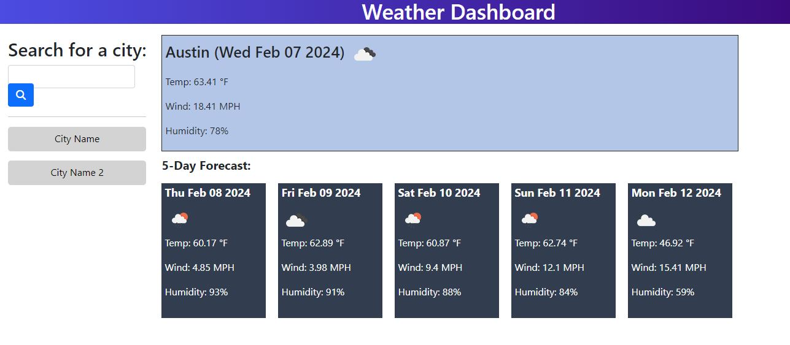

# Weather Dashboard
## Description & Usage

## Website Preview
- Website Link: https://clendinning1.github.io/weather-dashboard/
- Repository Link: https://github.com/clendinning1/weather-dashboard/

## Sources
### Tools
- [OpenWeatherMap API](https://openweathermap.org/)
- [Bootstrap](https://getbootstrap.com/)
### Resources
- [MDN](https://developer.mozilla.org/en-US/)
- [W3](https://www.w3schools.com/)
- https://stackoverflow.com/questions/65746475/how-to-get-data-info-from-openweathermap-api-dt
- https://stackoverflow.com/questions/2735881/adding-images-to-an-html-document-with-javascript
- https://www.codeease.net/programming/javascript/degree-symbol-javascript
- https://stackoverflow.com/questions/43051177/skip-numbers-while-doing-a-for-loop